# 4. PROJETO DO DESIGN DE INTERAÇÃO

## 4.1 Personas

### Persona 1 – Cliente Prático (Reserva Rápida)

### Persona 2 – Cliente Planejador (Ocasiões Especiais)

### Persona 3 – Administradora (Gestão do Restaurante)

### Persona 4 – Recepcionista Operacional

### Persona 5 – Cliente Avaliador (Experiência)

### Persona 6 – Cliente Digital Jovem)

## 4.2 Mapa de Empatia

## 4.3 Protótipos das Interfaces

Nesta seção são apresentados os protótipos de alta fidelidade desenvolvidos para o sistema Reserva Fácil. Esses protótipos possuem elevado nível de detalhamento visual e funcional, buscando representar de forma próxima o produto final a ser implementado.

O sistema foi projetado com o objetivo de facilitar a busca por restaurantes, a realização de reservas on-line e o gerenciamento de informações por clientes e estabelecimentos cadastrados. As interfaces contemplam fluxos completos de navegação, incluindo cadastro, login, consulta de restaurantes, reservas e funcionalidades administrativas.

Durante o desenvolvimento das telas, foram aplicados princípios de Interação Humano-Computador, considerando os princípios da Gestalt, recomendações ergonômicas e as Regras de Ouro de Ben Shneiderman. Esses conceitos contribuem para tornar a navegação mais intuitiva, organizada e eficiente.

Entre os princípios utilizados, destacam-se a proximidade e similaridade no agrupamento de elementos relacionados, figura-fundo para melhor distinção das áreas interativas e ponto focal em botões de ações principais. No aspecto ergonômico, buscou-se reduzir a carga cognitiva do usuário por meio de organização clara das informações, boa legibilidade e navegação simplificada.

Quanto às Regras de Ouro, o sistema prioriza consistência entre telas, feedback informativo após ações realizadas, prevenção de erros por validações, liberdade de navegação e redução da necessidade de memorização de informações.

Os protótipos apresentados a seguir são importantes para validar a usabilidade do sistema e identificar melhorias antes da implementação final da solução.

---

## Protótipo 1 – Tela Inicial / Landing Page

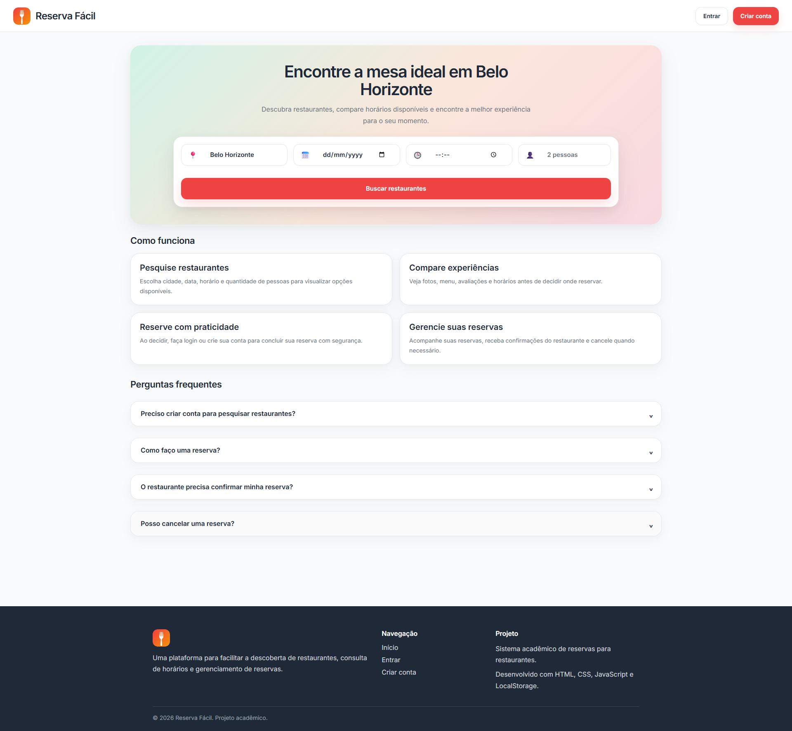

### 1. Objetivo da Tela

A tela inicial do sistema Reserva Fácil tem como objetivo apresentar a proposta da plataforma e permitir que o usuário inicie rapidamente a busca por restaurantes disponíveis. Nessa interface, o usuário pode informar cidade, data, horário e quantidade de pessoas, facilitando a localização de estabelecimentos compatíveis com sua necessidade.

Além disso, a tela apresenta seções explicativas sobre o funcionamento do sistema, perguntas frequentes e atalhos para autenticação, contribuindo para uma navegação clara desde o primeiro acesso.

### 2. Princípios Gestálticos Aplicados

Proximidade:
Os campos de pesquisa (cidade, data, horário e pessoas) estão posicionados próximos entre si, formando um grupo visual único relacionado ao processo de busca.

Similaridade:
Os campos de entrada seguem o mesmo padrão visual, com dimensões semelhantes, bordas arredondadas e alinhamento uniforme. Os cards informativos também mantêm padronização estética.

Figura-fundo:
O formulário central se destaca do plano de fundo por meio do contraste entre cores suaves e elementos brancos, facilitando a identificação da área principal de interação.

Ponto focal:
O botão “Buscar restaurantes” apresenta cor de destaque, chamando a atenção do usuário para a principal ação da tela.

Continuidade:
A organização vertical dos elementos conduz naturalmente o olhar do usuário: cabeçalho → área de busca → seção explicativa → perguntas frequentes → rodapé.

Região comum:
As seções “Como funciona” e “Perguntas frequentes” estão agrupadas em áreas próprias, permitindo melhor organização do conteúdo.

### 3. Recomendações Ergonômicas

Usabilidade:
A interface apresenta navegação simples e objetiva, permitindo que o usuário compreenda rapidamente como utilizar o sistema.

Carga cognitiva reduzida:
As informações estão distribuídas em blocos claros e organizados, evitando excesso de elementos simultâneos.

Legibilidade:
Há boa hierarquia tipográfica, contraste adequado entre texto e fundo e tamanhos de fonte confortáveis para leitura.

Eficiência de uso:
O usuário consegue iniciar sua busca em poucos passos, sem necessidade de cadastro prévio.

Aprendizado rápido:
Os textos explicativos e perguntas frequentes auxiliam novos usuários no entendimento do funcionamento da plataforma.

### 4. Regras de Ouro de Shneiderman

Consistência:
Botões, campos e seções seguem padrão visual uniforme em toda a interface.

Feedback informativo:
Os campos respondem à interação do usuário e os botões indicam claramente ações executáveis.

Atalhos:
Os botões “Entrar” e “Criar conta” permitem acesso rápido às funcionalidades de autenticação.

Prevenção de erros:
A divisão lógica dos campos reduz chances de preenchimento incorreto.

Usuário no controle:
O usuário escolhe livremente os critérios de busca antes de prosseguir.

Redução da carga de memória:
As opções necessárias estão visíveis na própria tela, sem exigir memorização de etapas.

Fechamento de diálogo:
Após preencher os dados, a ação de busca conduz naturalmente para a próxima etapa do sistema.

---

## Protótipo 2 – Tela de Descoberta de Restaurantes

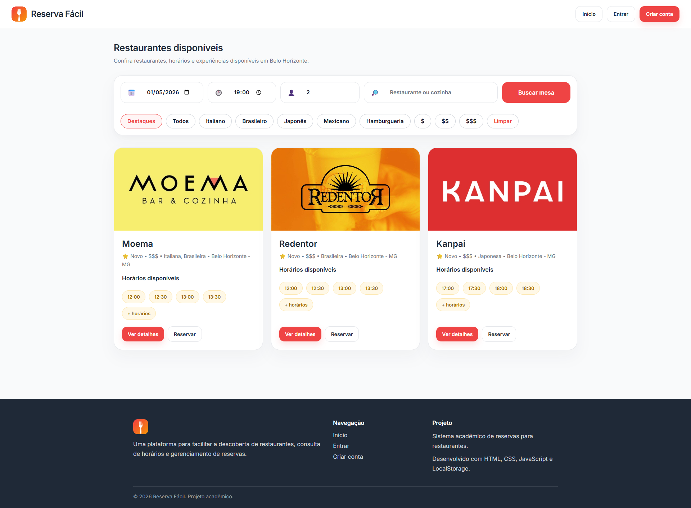

### 1. Objetivo da Tela

A tela de descoberta de restaurantes tem como objetivo apresentar ao usuário os estabelecimentos disponíveis de acordo com os critérios de busca informados, como data, horário, quantidade de pessoas, tipo de cozinha e faixa de preço.

Nessa interface, o usuário pode visualizar os restaurantes em formato de cards, consultar horários disponíveis, acessar mais detalhes sobre cada estabelecimento ou iniciar o processo de reserva. A tela também permite refinar a busca por meio de filtros, facilitando a comparação entre opções antes da tomada de decisão.

### 2. Princípios Gestálticos Aplicados

Proximidade:
Os filtros de busca estão agrupados em uma mesma área, indicando que fazem parte de uma única funcionalidade. Da mesma forma, as informações de cada restaurante aparecem próximas dentro de seus respectivos cards.

Similaridade:
Os cards dos restaurantes seguem o mesmo padrão visual, com imagem, nome, categoria, localização, horários e botões de ação. Isso facilita a comparação entre os estabelecimentos.

Figura-fundo:
Os cards brancos se destacam sobre o fundo claro da página, permitindo que o usuário identifique rapidamente os restaurantes disponíveis.

Ponto focal:
Os botões vermelhos, como “Buscar mesa” e “Ver detalhes”, direcionam a atenção do usuário para as principais ações da tela.

Continuidade:
A disposição dos filtros na parte superior e dos cards logo abaixo conduz o usuário de forma lógica: primeiro refinar a busca, depois analisar os resultados.

Região comum:
Cada card funciona como uma região visual independente, agrupando todas as informações relacionadas a um mesmo restaurante.

### 3. Recomendações Ergonômicas

Usabilidade:
A tela apresenta estrutura clara, permitindo que o usuário encontre restaurantes e compare opções de maneira simples.

Carga cognitiva reduzida:
As informações são organizadas em blocos visuais padronizados, evitando confusão e facilitando a leitura.

Legibilidade:
A hierarquia entre título, descrição, horários e botões contribui para boa compreensão das informações.

Eficiência de uso:
Os filtros e botões de ação permitem que o usuário refine sua busca e avance rapidamente para os detalhes ou reserva.

Facilidade de decisão:
A apresentação de horários, categorias, localização e faixa de preço auxilia o usuário na escolha do restaurante mais adequado.

### 4. Regras de Ouro de Shneiderman

Consistência:
A tela mantém o mesmo padrão visual da tela inicial, com navbar, botões arredondados, cores e tipografia consistentes.

Feedback informativo:
Os filtros selecionados e botões clicáveis indicam visualmente as possibilidades de interação.

Atalhos:
Os botões “Ver detalhes” e “Reservar” permitem acesso direto às principais ações do fluxo.

Prevenção de erros:
A separação dos filtros por categoria reduz a chance de escolhas equivocadas durante a busca.

Usuário no controle:
O usuário pode alterar os critérios de busca, limpar filtros, visualizar detalhes ou escolher iniciar uma reserva.

Redução da carga de memória:
As informações principais de cada restaurante ficam visíveis no card, sem exigir que o usuário memorize dados da busca anterior.

Fechamento de diálogo:
Após selecionar um restaurante ou horário, o sistema conduz o usuário para a próxima etapa do processo de reserva.

---

## Protótipo 3 – Modal de Autenticação para Reserva

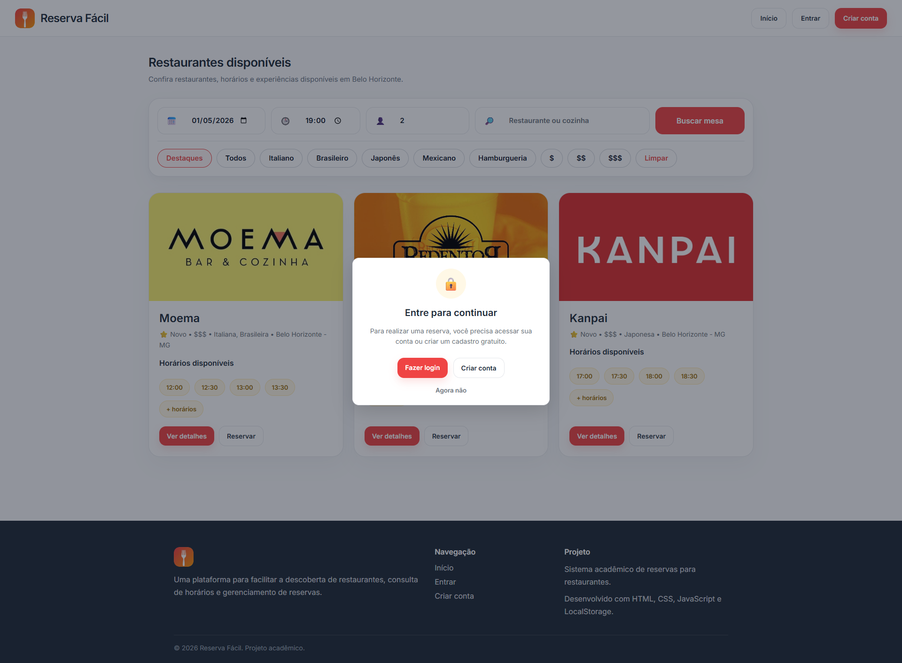

### 1. Objetivo da Tela

O modal de autenticação tem como objetivo impedir que usuários não autenticados realizem reservas diretamente no sistema Reserva Fácil.

Ele é exibido quando o usuário tenta realizar uma ação restrita, como clicar no botão “Reservar” na tela de descoberta de restaurantes, solicitando que o usuário faça login ou crie uma conta para prosseguir.

Essa abordagem garante maior segurança, rastreabilidade das reservas e integridade das informações no sistema, além de orientar o usuário de forma clara sobre o próximo passo necessário.

### 2. Princípios Gestálticos Aplicados

Figura-fundo:
O fundo da tela é suavemente escurecido, destacando o modal como elemento principal e direcionando o foco do usuário para a ação necessária.

Ponto focal:
O modal centralizado, aliado ao ícone de cadeado e ao botão “Fazer login”, cria um forte ponto de atenção visual.

Proximidade:
Os elementos do modal (título, descrição e botões) estão organizados próximos entre si, facilitando a compreensão da mensagem.

Similaridade:
Os botões seguem o padrão visual do sistema, mantendo consistência com outras telas.

Região comum:
O modal funciona como uma área isolada do restante da interface, agrupando todas as ações relacionadas à autenticação.

### 3. Recomendações Ergonômicas

Usabilidade:
A interface é simples e objetiva, apresentando claramente o motivo da interrupção da ação.

Carga cognitiva reduzida:
A mensagem é direta e não exige esforço interpretativo do usuário.

Legibilidade:
O contraste entre o modal e o fundo escurecido facilita a leitura e identificação das ações disponíveis.

Eficiência de uso:
O usuário pode rapidamente escolher entre fazer login, criar conta ou cancelar a ação.

Manutenção de contexto:
O modal permite que o usuário permaneça na mesma tela após fechá-lo, sem perder o estado da busca realizada.

### 4. Regras de Ouro de Shneiderman

Prevenção de erros:
O sistema impede a realização de reservas sem autenticação, evitando inconsistências nos dados.

Feedback informativo:
O modal explica claramente o motivo pelo qual a ação não pode ser concluída naquele momento.

Usuário no controle:
O usuário pode optar por fazer login, criar conta ou simplesmente fechar o modal.

Reversão de ações:
A opção “Agora não” permite cancelar a ação sem consequências.

Consistência:
O design do modal segue o padrão visual do restante do sistema.

Redução da carga de memória:
As opções são apresentadas diretamente na interface, sem necessidade de memorização de etapas.

Fechamento de diálogo:
A interação possui um fluxo claro: autenticar-se para prosseguir ou cancelar e continuar navegando.

---

## Protótipo 4 – Tela de Detalhes do Restaurante (Usuário não autenticado)

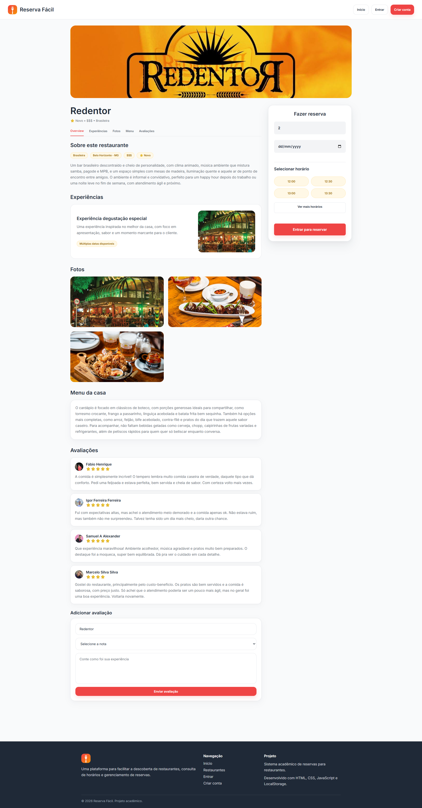

### 1. Objetivo da Tela

A tela de detalhes do restaurante tem como objetivo apresentar ao usuário todas as informações relevantes sobre um estabelecimento selecionado, permitindo uma análise completa antes da decisão de reserva.

Nesta interface, o usuário pode visualizar descrição do restaurante, categorias, localização, experiências oferecidas, fotos, cardápio e avaliações de outros clientes. Além disso, é possível consultar horários disponíveis para reserva. Para concluir a reserva, no entanto, é necessário realizar autenticação no sistema Reserva Fácil.

### 2. Princípios Gestálticos Aplicados

Proximidade:
As informações são organizadas em blocos bem definidos, como “Sobre o restaurante”, “Experiências”, “Fotos”, “Menu” e “Avaliações”, facilitando a leitura e compreensão.

Similaridade:
Os elementos visuais seguem um padrão consistente, como cards de avaliações, botões de horários e seções informativas, reforçando a identidade visual do sistema.

Figura-fundo:
Os conteúdos são apresentados em containers claros sobre um fundo neutro, permitindo fácil distinção entre seções e elementos interativos.

Ponto focal:
O card lateral de reserva se destaca visualmente, principalmente pelo botão “Entrar para reservar”, indicando a principal ação da tela.

Continuidade:
A organização vertical das seções conduz o usuário de forma fluida ao longo da página, permitindo exploração progressiva das informações.

Região comum:
Cada seção da página é delimitada em áreas específicas, agrupando conteúdos relacionados e melhorando a organização visual.

### 3. Recomendações Ergonômicas

Usabilidade:
A estrutura da página é clara e permite que o usuário encontre facilmente as informações desejadas.

Carga cognitiva reduzida:
As informações estão divididas em blocos, evitando sobrecarga visual.

Legibilidade:
Há boa hierarquia tipográfica, com títulos, descrições e conteúdos bem diferenciados.

Eficiência de uso:
O usuário consegue rapidamente acessar fotos, avaliações e horários sem necessidade de navegação adicional.

Apoio à decisão:
A presença de avaliações, descrição detalhada e imagens auxilia o usuário na escolha do restaurante.

### 4. Regras de Ouro de Shneiderman

Consistência:
A interface mantém o padrão visual das telas anteriores, com uso consistente de cores, botões e tipografia.

Feedback informativo:
Os elementos interativos, como horários e botões, indicam claramente suas funcionalidades.

Prevenção de erros:
A ação de reserva é bloqueada para usuários não autenticados, evitando inconsistências no sistema.

Usuário no controle:
O usuário pode navegar livremente pelas seções e escolher quando iniciar o processo de reserva.

Redução da carga de memória:
Todas as informações necessárias estão disponíveis na tela, sem necessidade de memorização.

Reversão de ações:
O usuário pode explorar o conteúdo sem realizar ações obrigatórias, mantendo controle sobre sua navegação.

Fechamento de diálogo:
A presença do botão “Entrar para reservar” indica claramente o próximo passo necessário para avançar no fluxo.

---

## Protótipo 5 – Tentativa de Reserva na Tela de Detalhes (Usuário não autenticado)

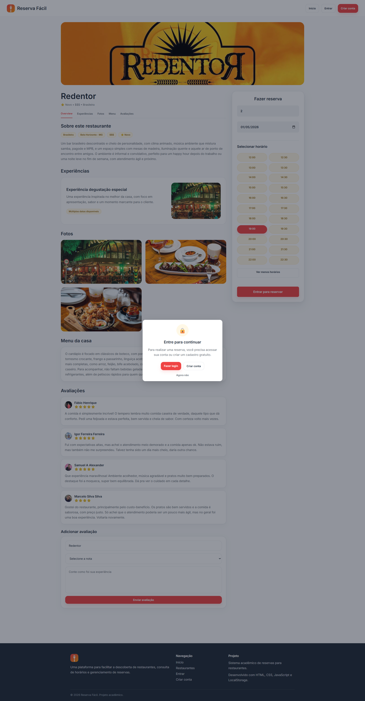

### 1. Objetivo da Tela

Este protótipo representa o momento em que o usuário, ainda não autenticado, tenta realizar uma reserva diretamente na tela de detalhes do restaurante no sistema Reserva Fácil.

Ao selecionar data, horário e quantidade de pessoas e acionar o botão de reserva, o sistema exibe um modal solicitando autenticação. O objetivo é garantir que apenas usuários identificados possam concluir reservas, mantendo a integridade dos dados e o controle das operações.

### 2. Princípios Gestálticos Aplicados

Figura-fundo:
O fundo da página é escurecido, destacando o modal como elemento principal e direcionando totalmente a atenção do usuário.

Ponto focal:
O modal central, juntamente com o ícone de cadeado e o botão “Fazer login”, cria um ponto de atenção claro e imediato.

Proximidade:
Os elementos do modal (título, descrição e botões) estão organizados de forma compacta, facilitando a leitura e compreensão.

Similaridade:
Os botões seguem o padrão visual do sistema, mantendo consistência com as demais interfaces.

Região comum:
O modal forma uma área isolada da interface, agrupando todas as ações relacionadas à autenticação.

### 3. Recomendações Ergonômicas

Usabilidade:
A interface comunica de forma clara o motivo pelo qual a ação não pode ser concluída.

Carga cognitiva reduzida:
A mensagem é direta, evitando esforço desnecessário por parte do usuário.

Legibilidade:
O contraste entre o modal e o fundo escurecido facilita a leitura e compreensão da mensagem.

Eficiência de uso:
O usuário pode rapidamente optar por fazer login, criar conta ou cancelar a ação.

Manutenção de contexto:
O usuário permanece na tela de detalhes do restaurante, sem perder as informações já visualizadas.

### 4. Regras de Ouro de Shneiderman

Prevenção de erros:
O sistema impede a realização de reservas sem autenticação, evitando inconsistências e registros inválidos.

Feedback informativo:
O modal explica claramente a necessidade de login para prosseguir com a reserva.

Usuário no controle:
O usuário pode escolher entre autenticar-se ou cancelar a ação.

Reversão de ações:
A opção “Agora não” permite interromper o fluxo sem consequências.

Consistência:
O modal segue o mesmo padrão visual e comportamento apresentado em outras telas do sistema.

Redução da carga de memória:
As opções são apresentadas diretamente na interface, sem necessidade de memorização de etapas.

Fechamento de diálogo:
O fluxo é claro: autenticar-se para continuar ou cancelar e permanecer na navegação atual.

---

## Protótipo 6 – Tela de Cadastro de Conta

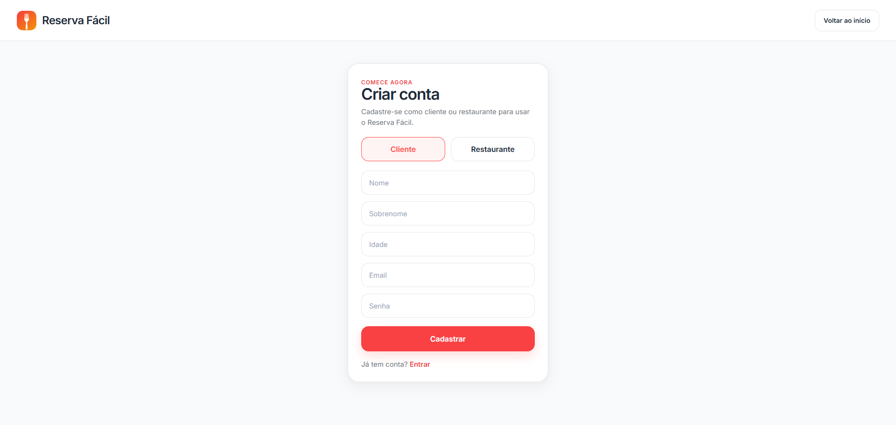

### 1. Objetivo da Tela

A tela de cadastro tem como objetivo permitir que novos usuários criem uma conta no sistema Reserva Fácil, possibilitando o acesso às funcionalidades completas da plataforma.

O usuário pode optar por se cadastrar como cliente ou restaurante (administrador), definindo assim o tipo de acesso e funcionalidades disponíveis após o login. A tela coleta informações essenciais como nome, sobrenome, idade, e-mail e senha, garantindo a identificação adequada do usuário no sistema.

### 2. Princípios Gestálticos Aplicados

Proximidade:
Os campos do formulário estão organizados de forma sequencial e agrupados, facilitando o preenchimento e entendimento da ordem das informações.

Similaridade:
Todos os campos de entrada seguem o mesmo padrão visual, com dimensões, bordas e espaçamento consistentes, reforçando a uniformidade da interface.

Figura-fundo:
O formulário central se destaca do fundo neutro, direcionando o foco do usuário para a área de cadastro.

Ponto focal:
O botão “Cadastrar”, com cor de destaque, evidencia a principal ação da tela.

Continuidade:
A disposição vertical dos campos conduz o usuário de forma natural do início ao fim do formulário.

Região comum:
A seleção entre “Cliente” e “Restaurante” está agrupada em uma mesma área, indicando uma escolha única e relacionada ao tipo de conta.

### 3. Recomendações Ergonômicas

Usabilidade:
A interface é simples e intuitiva, permitindo que o usuário compreenda facilmente como realizar o cadastro.

Carga cognitiva reduzida:
O número de campos é adequado e organizado, evitando sobrecarga de informações.

Legibilidade:
Os campos possuem boa visibilidade, com espaçamento adequado e rótulos claros.

Eficiência de uso:
O usuário consegue realizar o cadastro rapidamente, sem etapas desnecessárias.

Orientação ao usuário:
A opção de alternar entre tipos de conta facilita a compreensão das diferentes formas de uso do sistema.

### 4. Regras de Ouro de Shneiderman

Consistência:
A tela mantém o padrão visual do sistema, com cores, tipografia e componentes consistentes.

Feedback informativo:
Os campos indicam foco e interação, permitindo ao usuário compreender onde está inserindo informações.

Prevenção de erros:
A estrutura do formulário reduz a possibilidade de preenchimento incorreto.

Usuário no controle:
O usuário pode escolher o tipo de conta antes de concluir o cadastro.

Redução da carga de memória:
Todas as informações necessárias estão visíveis, sem exigir memorização de etapas.

Reversão de ações:
O usuário pode interromper o cadastro ou retornar à tela de login facilmente.

Fechamento de diálogo:
Após o cadastro, o sistema conduz o usuário para o próximo passo lógico, como autenticação ou acesso ao sistema.

---

## Protótipo 7 – Tela de Login (Cliente e Restaurante)

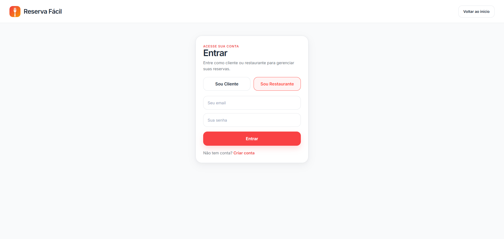

### 1. Objetivo da Tela

A tela de login tem como objetivo permitir que usuários previamente cadastrados acessem suas contas no sistema Reserva Fácil.

O usuário pode escolher o tipo de acesso — cliente ou restaurante (administrador) — e, em seguida, inserir suas credenciais (e-mail e senha) para autenticação. Após o login, o sistema direciona o usuário para as funcionalidades específicas de acordo com o perfil selecionado, como gerenciamento de reservas ou administração do estabelecimento.

### 2. Princípios Gestálticos Aplicados

Proximidade:
Os campos de e-mail e senha estão agrupados, formando um conjunto lógico de autenticação.

Similaridade:
Os campos de entrada possuem o mesmo estilo visual, assim como os botões de seleção de perfil, reforçando consistência e previsibilidade.

Figura-fundo:
O formulário central se destaca claramente do fundo neutro, facilitando o foco do usuário na ação de login.

Ponto focal:
O botão “Entrar” apresenta cor de destaque, indicando a principal ação da tela.

Continuidade:
A organização vertical dos elementos (seleção de perfil → campos → botão → link de cadastro) conduz o usuário de forma fluida.

Região comum:
A seleção entre “Sou Cliente” e “Sou Restaurante” está agrupada, indicando escolha exclusiva entre os tipos de acesso.

### 3. Recomendações Ergonômicas

Usabilidade:
A interface é simples e objetiva, permitindo rápida compreensão do processo de login.

Carga cognitiva reduzida:
A tela apresenta apenas os elementos essenciais, evitando distrações e excesso de informação.

Legibilidade:
Os campos e textos possuem bom contraste e espaçamento adequado, facilitando a leitura.

Eficiência de uso:
O usuário consegue realizar o login em poucos passos.

Orientação ao usuário:
A opção de escolha do perfil antes da autenticação evita confusão sobre o tipo de acesso.

### 4. Regras de Ouro de Shneiderman

Consistência:
A tela mantém o padrão visual adotado nas demais interfaces do sistema.

Feedback informativo:
Os campos respondem ao foco e interação, indicando claramente onde o usuário está inserindo dados.

Prevenção de erros:
A separação entre perfis evita acessos incorretos a funcionalidades indevidas.

Usuário no controle:
O usuário escolhe o tipo de acesso e pode decidir entre realizar login ou navegar para o cadastro.

Redução da carga de memória:
As informações necessárias estão visíveis, sem exigir memorização de etapas.

Reversão de ações:
O usuário pode retornar à tela inicial ou optar por criar uma conta.

Fechamento de diálogo:
Após inserir os dados e clicar em “Entrar”, o sistema conduz o usuário para sua área correspondente.

---

## Protótipo 8 – Tela de Descoberta de Restaurantes (Usuário autenticado)

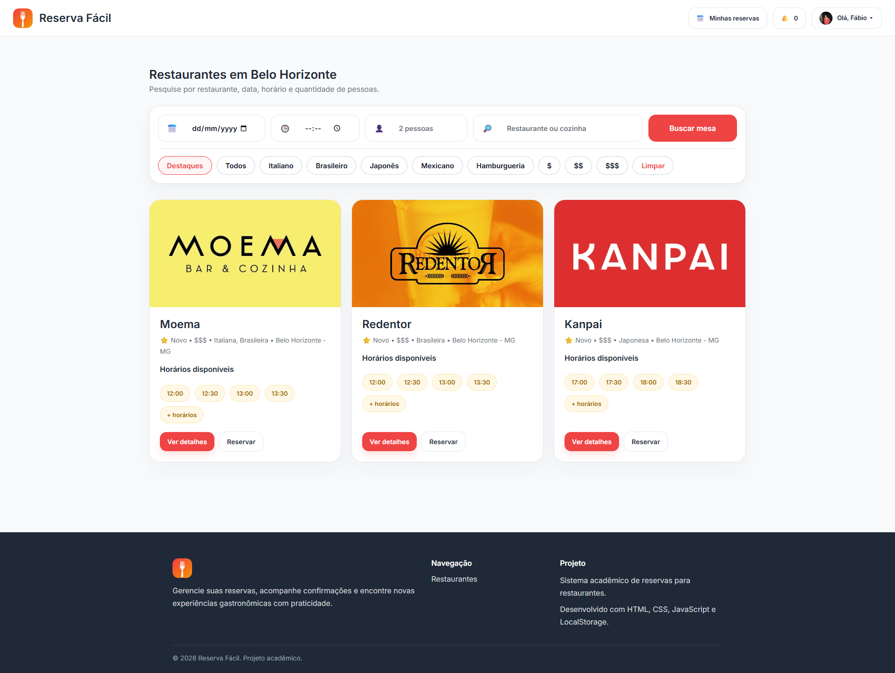

### 1. Objetivo da Tela

A tela de descoberta de restaurantes, após autenticação no sistema Reserva Fácil, tem como objetivo permitir que o usuário visualize, filtre e selecione restaurantes disponíveis para reserva.

Diferente da versão para usuários não autenticados, esta interface apresenta funcionalidades adicionais, como acesso ao perfil do usuário, notificações e gerenciamento de reservas por meio do botão “Minhas reservas”. O usuário autenticado pode iniciar diretamente o processo de reserva sem interrupções, tornando a navegação mais fluida e eficiente.

### 2. Princípios Gestálticos Aplicados

Proximidade:
Os filtros de busca permanecem agrupados na parte superior da tela, enquanto os cards de restaurantes estão organizados logo abaixo, facilitando a relação entre filtros e resultados.

Similaridade:
Os cards seguem o mesmo padrão visual, permitindo comparação entre restaurantes de forma rápida. Os botões e elementos da navbar também mantêm consistência visual.

Figura-fundo:
Os cards se destacam sobre o fundo neutro, garantindo clareza na identificação das opções disponíveis.

Ponto focal:
O botão “Buscar mesa” e os botões “Ver detalhes” direcionam a atenção para as principais ações da tela.

Continuidade:
A estrutura da tela conduz o usuário naturalmente do topo (filtros) para os resultados (restaurantes).

Região comum:
A navbar superior agrupa funcionalidades do usuário autenticado, como perfil, notificações e acesso às reservas.

### 3. Recomendações Ergonômicas

Usabilidade:
A interface mantém simplicidade e clareza, agora com funcionalidades adicionais sem comprometer a navegação.

Carga cognitiva reduzida:
Mesmo com novos elementos (perfil, notificações), a organização da tela evita sobrecarga visual.

Legibilidade:
Os elementos continuam bem distribuídos, com boa hierarquia visual e fácil leitura.

Eficiência de uso:
O usuário autenticado pode realizar reservas diretamente, sem necessidade de etapas adicionais.

Acesso rápido a funcionalidades:
A navbar permite acesso imediato ao perfil, notificações e reservas.

### 4. Regras de Ouro de Shneiderman

Consistência:
A tela mantém o mesmo padrão visual das demais interfaces do sistema.

Feedback informativo:
A presença do nome do usuário e ícone de perfil indica claramente que o login foi realizado com sucesso.

Atalhos:
Botões como “Minhas reservas” e ícone de notificações permitem acesso rápido às funcionalidades principais.

Usuário no controle:
O usuário pode navegar livremente, aplicar filtros, visualizar detalhes ou iniciar reservas.

Prevenção de erros:
Com o usuário autenticado, o sistema garante que as ações realizadas estejam vinculadas corretamente à conta.

Redução da carga de memória:
Informações relevantes permanecem visíveis, sem necessidade de memorização.

Fechamento de diálogo:
As ações realizadas, como selecionar um restaurante ou iniciar uma reserva, conduzem naturalmente para as próximas etapas do fluxo.

---

## Protótipo 9 – Realização de Reserva na Tela de Descoberta (Usuário autenticado)

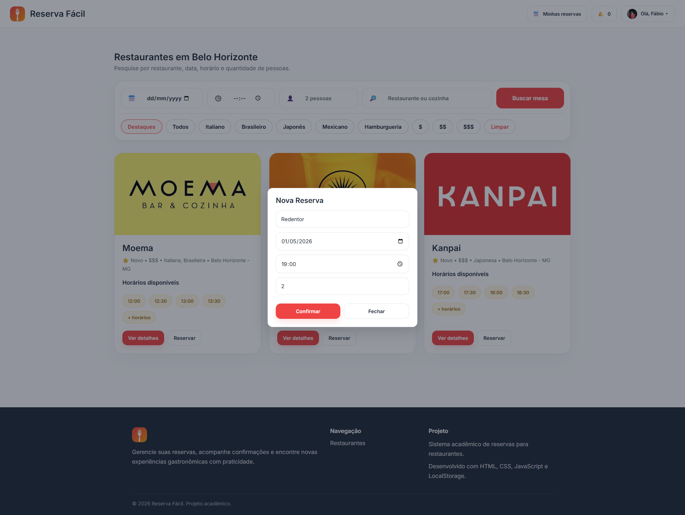

### 1. Objetivo da Tela

Este protótipo representa o fluxo de realização de reserva diretamente na tela de descoberta de restaurantes, disponível para usuários autenticados no sistema Reserva Fácil.

Ao selecionar um restaurante e acionar a opção de reserva, o sistema exibe um modal onde o usuário pode confirmar as informações essenciais, como data, horário e quantidade de pessoas. Essa funcionalidade tem como objetivo agilizar o processo de reserva, especialmente para usuários que já conhecem o restaurante e desejam concluir a ação de forma rápida, sem acessar a página de detalhes.

### 2. Princípios Gestálticos Aplicados

Figura-fundo:
O fundo escurecido destaca o modal de reserva, direcionando a atenção do usuário para a ação principal.

Ponto focal:
O modal centralizado, juntamente com o botão “Confirmar”, cria um ponto de destaque claro na interface.

Proximidade:
Os campos de informações da reserva estão agrupados, facilitando a leitura e compreensão dos dados.

Similaridade:
Os campos seguem o mesmo padrão visual dos demais formulários do sistema, garantindo consistência.

Região comum:
O modal atua como uma área isolada, reunindo todas as informações necessárias para a confirmação da reserva.

### 3. Recomendações Ergonômicas

Usabilidade:
A interface é simples e direta, permitindo que o usuário finalize a reserva com poucos passos.

Carga cognitiva reduzida:
As informações apresentadas são objetivas e já preenchidas com base na seleção anterior.

Legibilidade:
Os campos possuem boa organização e contraste adequado para leitura.

Eficiência de uso:
O processo de reserva é otimizado, evitando navegação desnecessária para outras telas.

Agilidade no fluxo:
O modal reduz etapas, facilitando a conclusão rápida da ação.

### 4. Regras de Ouro de Shneiderman

Consistência:
O modal segue o padrão visual adotado nas demais interações do sistema.

Feedback informativo:
As informações da reserva são apresentadas claramente antes da confirmação.

Prevenção de erros:
Os dados são exibidos para conferência antes da finalização da reserva.

Usuário no controle:
O usuário pode confirmar ou cancelar a ação por meio dos botões “Confirmar” e “Fechar”.

Reversão de ações:
A opção “Fechar” permite interromper o processo sem impacto.

Redução da carga de memória:
Os dados da reserva são exibidos no modal, evitando necessidade de memorização.

Fechamento de diálogo:
Após confirmar, o sistema conclui a ação e segue para o próximo estado do fluxo (confirmação da reserva).

---

## Protótipo 10 – Confirmação de Reserva Realizada

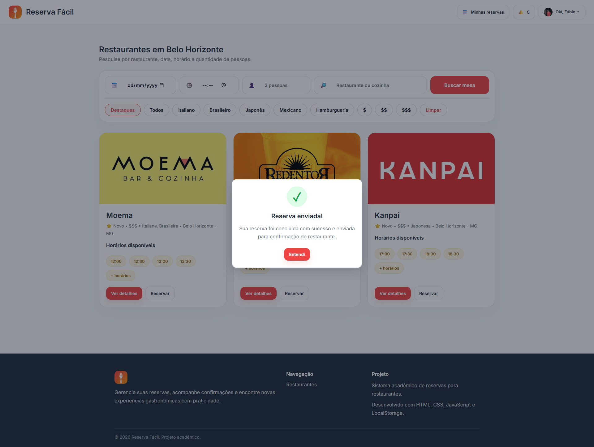

### 1. Objetivo da Tela

Este protótipo representa o feedback visual apresentado ao usuário após a conclusão de uma reserva no sistema Reserva Fácil.

Após confirmar os dados da reserva, o sistema exibe um modal informando que a solicitação foi enviada com sucesso para o restaurante. O objetivo principal dessa interface é fornecer uma confirmação clara da ação realizada, garantindo que o usuário compreenda que o processo foi concluído corretamente.

### 2. Princípios Gestálticos Aplicados

Figura-fundo:
O fundo da tela é escurecido, destacando o modal de confirmação como elemento principal da interface.

Ponto focal:
O ícone de confirmação (check) e a mensagem “Reserva enviada!” funcionam como elementos centrais de atenção.

Proximidade:
Os elementos do modal (ícone, título, descrição e botão) estão organizados de forma próxima, facilitando a leitura e compreensão.

Similaridade:
O botão “Entendi” segue o padrão visual dos demais botões do sistema, mantendo consistência.

Região comum:
O modal atua como uma área isolada, agrupando todas as informações relacionadas ao feedback da ação.

### 3. Recomendações Ergonômicas

Usabilidade:
A mensagem é clara e direta, informando o sucesso da operação.

Carga cognitiva reduzida:
A interface apresenta apenas as informações essenciais, evitando excesso de conteúdo.

Legibilidade:
O contraste entre o modal e o fundo facilita a leitura e compreensão da mensagem.

Eficiência de uso:
O usuário compreende rapidamente o resultado da ação e pode prosseguir sem dúvidas.

Confiança do usuário:
A confirmação visual reforça a segurança e confiabilidade do sistema.

### 4. Regras de Ouro de Shneiderman

Feedback informativo:
O sistema comunica claramente que a reserva foi realizada com sucesso.

Fechamento de diálogo:
A interação é concluída com uma mensagem clara, indicando o fim do processo.

Consistência:
O modal segue o padrão visual utilizado nas demais interações do sistema.

Usuário no controle:
O usuário pode fechar o modal por meio do botão “Entendi”.

Redução da carga de memória:
A mensagem apresenta todas as informações necessárias sem exigir interpretação adicional.

Prevenção de erros:
O feedback evita dúvidas sobre o status da reserva realizada.

Reversão de ações:
Embora a ação já tenha sido concluída, o sistema mantém a navegação acessível para futuras interações.

---

## Protótipo 11 – Tela de Detalhes do Restaurante (Usuário autenticado)

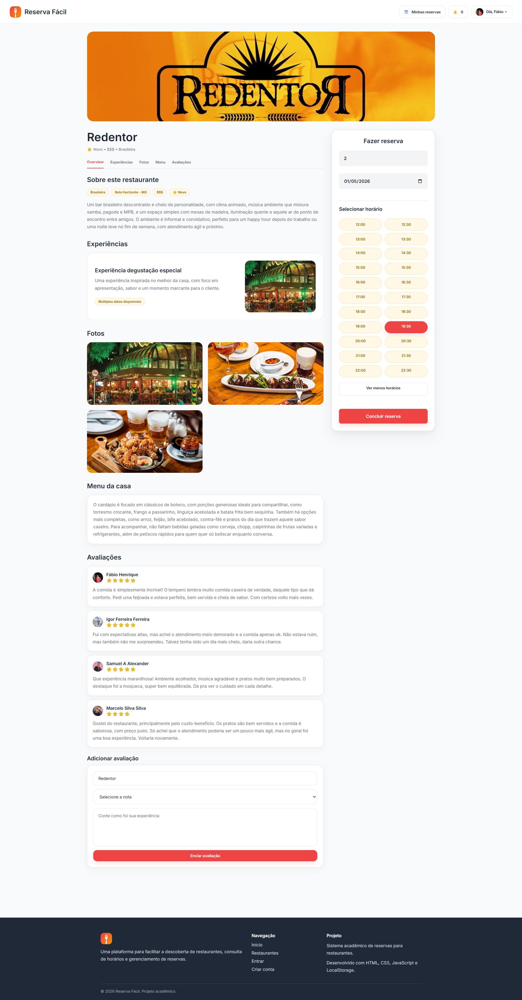

### 1. Objetivo da Tela

A tela de detalhes do restaurante, após autenticação no sistema Reserva Fácil, tem como objetivo permitir que o usuário visualize todas as informações do estabelecimento e realize reservas diretamente na própria página.

Nesta interface, o usuário pode acessar descrição do restaurante, experiências, fotos, cardápio e avaliações de outros clientes, além de selecionar data, horário e quantidade de pessoas por meio do painel lateral de reserva. Diferente da versão sem login, o usuário autenticado pode concluir a reserva sem interrupções, tornando o processo mais direto e eficiente.

### 2. Princípios Gestálticos Aplicados

Proximidade:
As informações do restaurante estão organizadas em seções bem definidas, enquanto o painel de reserva agrupa todos os elementos necessários para a ação.

Similaridade:
Os elementos visuais, como botões de horários, cards de avaliações e seções informativas, seguem um padrão consistente.

Figura-fundo:
Os conteúdos são apresentados em containers claros sobre fundo neutro, facilitando a separação visual das seções.

Ponto focal:
O painel lateral de reserva e o botão “Concluir reserva” se destacam como principais pontos de interação.

Continuidade:
A estrutura da página conduz o usuário de forma natural: informações → análise → ação (reserva).

Região comum:
O painel de reserva funciona como uma área independente, reunindo todos os elementos necessários para a realização da reserva.

### 3. Recomendações Ergonômicas

Usabilidade:
A interface permite acesso rápido às informações e à ação de reserva em uma única tela.

Carga cognitiva reduzida:
A divisão por seções evita sobrecarga de informações.

Legibilidade:
Os conteúdos são bem organizados, com boa hierarquia visual e contraste adequado.

Eficiência de uso:
O usuário consegue visualizar horários disponíveis e concluir a reserva sem navegar para outras páginas.

Apoio à decisão:
A presença de avaliações, fotos e descrição auxilia na escolha antes da reserva.

### 4. Regras de Ouro de Shneiderman

Consistência:
A interface mantém o padrão visual das demais telas do sistema.

Feedback informativo:
Os horários selecionados e botões indicam claramente as ações disponíveis.

Prevenção de erros:
A seleção de horários disponíveis evita conflitos e inconsistências na reserva.

Usuário no controle:
O usuário pode escolher livremente os parâmetros da reserva antes de confirmar.

Redução da carga de memória:
Todas as informações necessárias estão visíveis na tela.

Reversão de ações:
O usuário pode alterar os dados da reserva antes de concluir.

Fechamento de diálogo:
A ação de “Concluir reserva” conduz diretamente para a confirmação da reserva.

---

## Protótipo 12 – Confirmação de Reserva na Tela de Detalhes (Usuário autenticado)

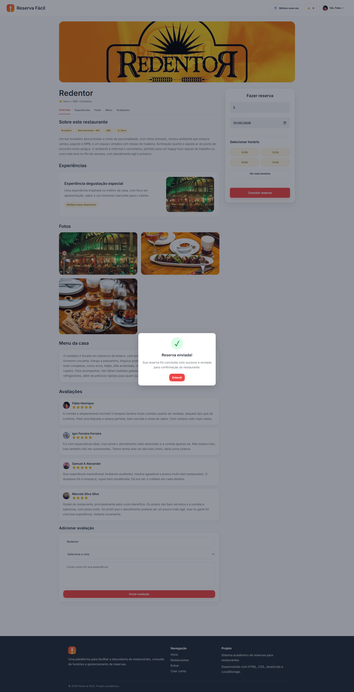

### 1. Objetivo da Tela

Este protótipo representa o feedback apresentado ao usuário após a conclusão de uma reserva diretamente na tela de detalhes do restaurante no sistema Reserva Fácil.

Após selecionar data, horário e quantidade de pessoas e confirmar a ação, o sistema exibe um modal indicando que a reserva foi enviada com sucesso para o restaurante. O objetivo é garantir que o usuário tenha uma confirmação clara da operação realizada, reforçando a confiabilidade do sistema.

### 2. Princípios Gestálticos Aplicados

Figura-fundo:
O fundo da interface é escurecido, destacando o modal de confirmação como elemento principal.

Ponto focal:
O ícone de confirmação (check) e a mensagem “Reserva enviada!” centralizam a atenção do usuário.

Proximidade:
Os elementos do modal (ícone, título, descrição e botão) estão organizados de forma próxima e coesa.

Similaridade:
O botão “Entendi” segue o padrão visual do sistema, mantendo consistência com outras telas.

Região comum:
O modal agrupa todas as informações relacionadas à confirmação da reserva em uma área isolada.

### 3. Recomendações Ergonômicas

Usabilidade:
A mensagem é clara e objetiva, informando o sucesso da ação realizada.

Carga cognitiva reduzida:
A interface apresenta apenas o essencial, evitando excesso de informação.

Legibilidade:
O contraste entre o modal e o fundo facilita a leitura e compreensão da mensagem.

Eficiência de uso:
O usuário entende rapidamente o resultado da ação e pode prosseguir na navegação.

Confiança do usuário:
A confirmação visual reforça a segurança e previsibilidade do sistema.

### 4. Regras de Ouro de Shneiderman

Feedback informativo:
O sistema comunica de forma clara que a reserva foi realizada com sucesso.

Fechamento de diálogo:
A interação é finalizada com uma mensagem objetiva, indicando o fim do processo.

Consistência:
O padrão visual do modal é mantido em relação às demais interações do sistema.

Usuário no controle:
O usuário pode fechar o modal por meio do botão “Entendi”.

Redução da carga de memória:
A mensagem apresenta todas as informações necessárias sem exigir interpretação adicional.

Prevenção de erros:
O feedback evita dúvidas quanto ao status da reserva.

Reversão de ações:
Apesar da ação já ter sido concluída, o sistema mantém a navegação disponível para novas interações.

---

## Protótipo 13 – Tela de Minhas Reservas

### 1. Objetivo da Tela

A tela de “Minhas reservas” tem como objetivo permitir que o usuário visualize e gerencie todas as suas reservas realizadas no sistema Reserva Fácil.

Nesta interface, o usuário pode acompanhar o status das reservas, organizadas em categorias como pendentes, concluídas e canceladas, além de utilizar um filtro para visualizar tipos específicos. Também é possível cancelar reservas pendentes diretamente pela interface, proporcionando maior controle sobre suas ações.

### 2. Princípios Gestálticos Aplicados

Proximidade:
As reservas são agrupadas por status (pendentes, concluídas e canceladas), facilitando a leitura e organização das informações.

Similaridade:
Os cards de reserva seguem o mesmo padrão visual, com nome do restaurante, data, horário, quantidade de pessoas e status, permitindo fácil comparação.

Figura-fundo:
Os cards se destacam sobre o fundo da página, garantindo boa visibilidade dos itens.

Ponto focal:
Os indicadores de status (cores como verde, amarelo e vermelho) chamam atenção para a situação de cada reserva.

Continuidade:
A disposição vertical das seções permite uma navegação fluida entre os diferentes estados das reservas.

Região comum:
Cada grupo de reservas (pendentes, concluídas e canceladas) forma uma área distinta, facilitando a segmentação das informações.

### 3. Recomendações Ergonômicas

Usabilidade:
A interface permite que o usuário compreenda rapidamente o estado de suas reservas.

Carga cognitiva reduzida:
A separação por categorias evita sobrecarga visual e melhora a organização.

Legibilidade:
Os dados são apresentados de forma clara, com boa hierarquia visual e uso de cores para reforçar informações.

Eficiência de uso:
O usuário consegue localizar e gerenciar reservas rapidamente.

Controle do usuário:
A possibilidade de cancelar reservas pendentes diretamente na tela aumenta a autonomia do usuário.

### 4. Regras de Ouro de Shneiderman

Consistência:
A tela mantém o padrão visual das demais interfaces do sistema.

Feedback informativo:
Os status das reservas são exibidos de forma clara por meio de cores e etiquetas.

Prevenção de erros:
A organização das reservas reduz a chance de ações equivocadas.

Usuário no controle:
O usuário pode visualizar, filtrar e cancelar reservas conforme necessário.

Redução da carga de memória:
Todas as informações relevantes estão disponíveis na tela, sem necessidade de memorização.

Reversão de ações:
O cancelamento de reservas permite controle sobre ações já realizadas.

Fechamento de diálogo:
Cada ação, como cancelamento ou visualização, possui um fluxo claro e compreensível.

---

## Protótipo 14 – Tela de Minhas Reservas (Reserva confirmada e notificação)

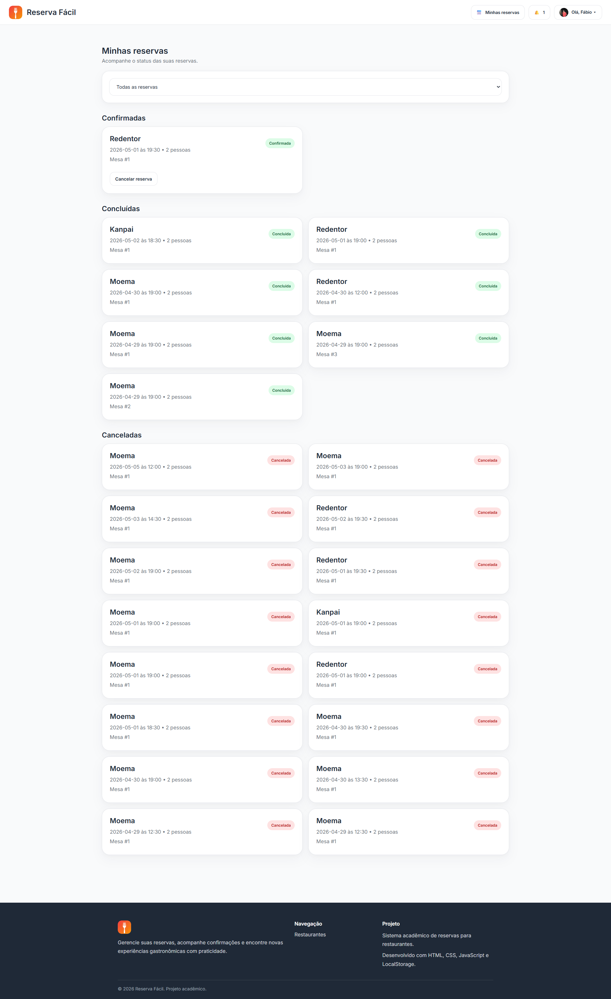

### 1. Objetivo da Tela

Este protótipo representa a visualização de reservas confirmadas na tela “Minhas reservas”, bem como a notificação recebida pelo usuário após a confirmação da reserva no sistema Reserva Fácil.

Nesta interface, o usuário pode identificar facilmente reservas com status confirmado, além de manter a possibilidade de cancelamento. A presença do indicador de notificação na navbar reforça que houve uma atualização relevante no sistema, mantendo o usuário informado sobre o andamento de suas reservas.

### 2. Princípios Gestálticos Aplicados

Proximidade:
As reservas continuam organizadas por status, com destaque para a seção “Confirmadas”, facilitando a leitura.

Similaridade:
Os cards mantêm o mesmo padrão visual, independentemente do status, com diferenciação feita apenas por cores e etiquetas.

Figura-fundo:
Os cards se destacam sobre o fundo neutro, garantindo boa visibilidade das informações.

Ponto focal:
O selo “Confirmada” em destaque e o indicador de notificação na navbar direcionam a atenção do usuário.

Continuidade:
A organização da página mantém fluxo lógico entre as diferentes categorias de reservas.

Região comum:
Cada grupo de reservas (confirmadas, concluídas, canceladas) permanece organizado em blocos distintos.

### 3. Recomendações Ergonômicas

Usabilidade:
A interface permite rápida identificação do status atualizado da reserva.

Carga cognitiva reduzida:
A utilização de cores e agrupamento por categorias facilita a compreensão.

Legibilidade:
As informações são apresentadas de forma clara, com boa hierarquia visual.

Eficiência de uso:
O usuário consegue visualizar rapidamente reservas confirmadas e tomar ações, como cancelamento.

Atualização de estado:
A notificação auxilia o usuário a perceber mudanças importantes no sistema.

### 4. Regras de Ouro de Shneiderman

Feedback informativo:
O sistema informa claramente que a reserva foi confirmada por meio de etiquetas e notificações.

Consistência:
O layout e os componentes seguem o padrão visual das demais telas.

Usuário no controle:
Mesmo com a reserva confirmada, o usuário ainda pode optar por cancelá-la.

Prevenção de erros:
A distinção visual entre os status reduz a chance de ações equivocadas.

Redução da carga de memória:
As informações estão visíveis e organizadas, dispensando memorização.

Reversão de ações:
A possibilidade de cancelamento mantém o controle nas mãos do usuário.

Fechamento de diálogo:
A confirmação da reserva representa uma etapa concluída no fluxo, devidamente sinalizada ao usuário.

---

## Protótipo 15 – Notificação de Reserva Confirmada

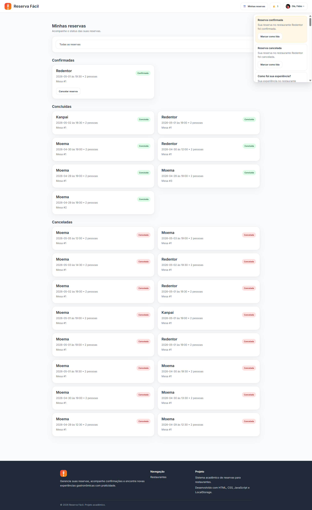

### 1. Objetivo da Tela

Este protótipo representa a exibição detalhada da notificação de atualização de status de reserva no sistema Reserva Fácil.

Ao acessar o painel de notificações, o usuário visualiza mensagens informando alterações importantes, como a confirmação ou cancelamento de reservas. Essa funcionalidade tem como objetivo manter o usuário atualizado em tempo real sobre o status de suas solicitações, melhorando a comunicação entre o sistema e o usuário.

### 2. Princípios Gestálticos Aplicados

Proximidade:
As notificações são agrupadas em um mesmo painel, organizadas de forma sequencial para fácil leitura.

Similaridade:
Os cards de notificação seguem um padrão visual consistente, com diferenciação por conteúdo e estado.

Figura-fundo:
O painel de notificações se destaca sobre o restante da interface, permitindo fácil identificação.

Ponto focal:
A notificação mais recente (como “Reserva confirmada”) é destacada, chamando a atenção do usuário.

Continuidade:
A organização vertical das notificações permite leitura natural e progressiva.

Região comum:
O painel lateral agrupa todas as notificações, separando-as do restante da interface principal.

### 3. Recomendações Ergonômicas

Usabilidade:
A interface apresenta informações claras e organizadas sobre eventos importantes.

Carga cognitiva reduzida:
As mensagens são curtas e diretas, facilitando a compreensão.

Legibilidade:
O contraste e a estrutura dos cards permitem leitura rápida.

Eficiência de uso:
O usuário consegue acessar rapidamente informações relevantes sem navegar para outras telas.

Atualização contínua:
As notificações mantêm o usuário informado sobre mudanças no sistema.

### 4. Regras de Ouro de Shneiderman

Feedback informativo:
O sistema comunica alterações importantes, como confirmação ou cancelamento de reservas.

Consistência:
O painel segue o padrão visual do sistema.

Usuário no controle:
O usuário pode acessar ou ignorar as notificações conforme desejar.

Redução da carga de memória:
As informações são apresentadas diretamente, sem exigir memorização.

Prevenção de erros:
A notificação evita dúvidas quanto ao status da reserva.

Fechamento de diálogo:
A confirmação da reserva é apresentada como conclusão de uma etapa do fluxo.

Reversão de ações:
A partir da notificação, o usuário pode tomar decisões adicionais, como avaliar ou gerenciar reservas.

---

## Protótipo 16 – Notificação de Avaliação de Experiência

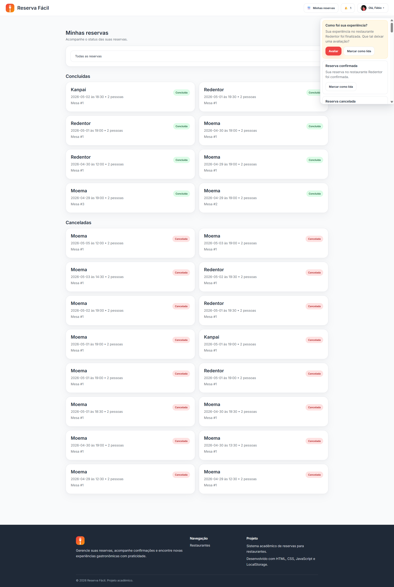

### 1. Objetivo da Tela
Este protótipo representa a notificação exibida ao usuário após a conclusão de uma reserva no sistema Reserva Fácil.
Quando o restaurante finaliza o atendimento (reserva concluída), o sistema envia uma notificação convidando o usuário a avaliar sua experiência. O objetivo é incentivar o feedback dos clientes, contribuindo para a melhoria contínua dos serviços e auxiliando outros usuários na tomada de decisão.

### 2. Princípios Gestálticos Aplicados
Proximidade:
Os elementos da notificação (título, descrição e botões) estão organizados de forma agrupada, facilitando a leitura.
Similaridade:
As notificações seguem o mesmo padrão visual, com diferenciação apenas no conteúdo e destaque da ação principal.
Figura-fundo:
O painel de notificações se destaca sobre o restante da interface, direcionando a atenção do usuário.
Ponto focal:
A notificação de avaliação é destacada visualmente, chamando atenção para a ação desejada.
Continuidade:
As notificações são organizadas verticalmente, permitindo leitura fluida e sequencial.
Região comum:
O painel lateral agrupa todas as notificações, separando-as do conteúdo principal da página.

### 3. Recomendações Ergonômicas
Usabilidade:
A interface apresenta de forma clara a ação esperada do usuário (avaliar a experiência).
Carga cognitiva reduzida:
A mensagem é direta e objetiva, facilitando o entendimento.
Legibilidade:
O contraste e o layout permitem leitura rápida da notificação.
Eficiência de uso:
O usuário pode acessar rapidamente a funcionalidade de avaliação por meio do botão “Avaliar”.
Engajamento do usuário:
A notificação incentiva a participação ativa do usuário no sistema.

### 4. Regras de Ouro de Shneiderman
Feedback informativo:
O sistema informa que a experiência foi concluída e solicita uma avaliação.
Consistência:
O painel de notificações mantém o padrão visual do sistema.
Usuário no controle:
O usuário pode optar por avaliar ou ignorar a notificação.
Redução da carga de memória:
As informações são apresentadas diretamente, sem exigir memorização.
Prevenção de erros:
A clareza da mensagem evita interpretações equivocadas.
Fechamento de diálogo:
A notificação representa o encerramento do ciclo da reserva e início de uma nova interação (avaliação).
Reversão de ações:
O usuário pode decidir posteriormente realizar a avaliação, mantendo flexibilidade no fluxo.

---

## Protótipo 17 – Modal de Avaliação de Restaurante

### 1. Objetivo da Tela

Este protótipo apresenta o modal de avaliação acessado a partir do painel de notificações do sistema Reserva Fácil.

O objetivo da tela é permitir que o usuário registre sua experiência após a conclusão de uma reserva, fornecendo uma nota e um comentário. Essa funcionalidade contribui para a geração de feedbacks, auxiliando outros usuários e melhorando a qualidade dos serviços oferecidos pelos restaurantes.

### 2. Princípios Gestálticos Aplicados

Proximidade:
Os campos de avaliação (nome do restaurante, nota e comentário) estão organizados próximos entre si, formando um grupo lógico de preenchimento.

Similaridade:
Os campos seguem o mesmo padrão visual (inputs com bordas arredondadas), reforçando sua função como elementos de entrada de dados.

Figura-fundo:
O modal se destaca do fundo escurecido da página, evidenciando que se trata de uma ação em foco.

Ponto focal:
O botão “Enviar avaliação” é destacado pela cor vermelha, indicando a ação principal da tela.

Continuidade:
A disposição vertical dos elementos orienta o usuário de forma natural no preenchimento: seleção → avaliação → envio.

Região comum:
O modal delimita claramente a área de interação, separando-a do restante da interface.

### 3. Recomendações Ergonômicas

Usabilidade:
A interface é simples e objetiva, permitindo que o usuário avalie rapidamente sua experiência.

Carga cognitiva reduzida:
O número limitado de campos facilita o preenchimento e evita sobrecarga de informações.

Legibilidade:
Os textos e campos são claros, com bom espaçamento e contraste adequado.

Eficiência de uso:
O usuário pode concluir a avaliação em poucos passos, com interação direta.

Satisfação do usuário:
A funcionalidade permite que o usuário expresse sua opinião, aumentando o engajamento com o sistema.

### 4. Regras de Ouro de Shneiderman

Consistência:
O modal segue o padrão visual utilizado em outras interações do sistema.

Feedback informativo:
Após o envio, o sistema pode apresentar confirmação da avaliação realizada.

Usuário no controle:
O usuário pode optar por enviar a avaliação ou fechar o modal sem concluir a ação.

Prevenção de erros:
A estrutura simples reduz a chance de preenchimento incorreto.

Redução da carga de memória:
O nome do restaurante já é apresentado, evitando necessidade de lembrança.

Fechamento de diálogo:
O envio da avaliação conclui o ciclo iniciado pela notificação.

Reversão de ações:
O usuário pode cancelar o processo antes de enviar a avaliação.

---

## Protótipo 18 – Tela de Minhas Avaliações

### 1. Objetivo da Tela

Este protótipo apresenta a tela de visualização das avaliações realizadas pelo usuário no sistema Reserva Fácil.

O objetivo é permitir que o usuário acompanhe todo o histórico de feedbacks já enviados, possibilitando revisão de suas experiências em diferentes restaurantes. A tela também reforça a transparência e o engajamento do usuário com a plataforma.

### 2. Princípios Gestálticos Aplicados

Proximidade:
Cada avaliação é organizada em um card, agrupando nome do usuário, nota, restaurante e comentário.

Similaridade:
Todos os cards seguem o mesmo padrão visual, facilitando a identificação e leitura das avaliações.

Figura-fundo:
Os cards se destacam do fundo da página, evidenciando as informações principais.

Ponto focal:
As estrelas de avaliação funcionam como ponto focal, destacando rapidamente a nota atribuída.

Continuidade:
As avaliações são organizadas verticalmente, permitindo leitura sequencial e fluida.

Região comum:
Cada card delimita claramente uma avaliação individual, separando-a das demais.

### 3. Recomendações Ergonômicas

Usabilidade:
A organização em lista facilita a navegação e compreensão das avaliações.

Carga cognitiva reduzida:
A padronização dos cards permite rápida identificação das informações relevantes.

Legibilidade:
Os textos são claros e bem espaçados, garantindo boa leitura.

Eficiência de uso:
O usuário pode visualizar rapidamente todas as suas avaliações sem necessidade de múltiplas ações.

Satisfação do usuário:
A tela reforça a sensação de participação ativa do usuário no sistema.

### 4. Regras de Ouro de Shneiderman

Consistência:
A interface mantém o padrão visual utilizado em outras telas do sistema.

Feedback informativo:
As avaliações exibem claramente as informações inseridas anteriormente pelo usuário.

Usuário no controle:
O usuário acessa suas avaliações livremente a partir do menu de perfil.

Redução da carga de memória:
Todas as avaliações são apresentadas, evitando necessidade de lembrança.

Prevenção de erros:
Como se trata de visualização, não há risco de erro na interação.

Fechamento de diálogo:
A tela representa o encerramento do ciclo de avaliação iniciado após a reserva.

Reversão de ações:
Caso implementado futuramente, o sistema pode permitir edição ou exclusão de avaliações.

---

## Protótipo 19 – Modal de Edição de Perfil do Usuário

### 1. Objetivo da Tela

Este protótipo apresenta o modal de edição de perfil do usuário no sistema Reserva Fácil.

O objetivo da tela é permitir que o usuário atualize suas informações pessoais, como nome, email, idade, telefone e foto de perfil. Essa funcionalidade contribui para a personalização da experiência e para a melhoria da comunicação dentro da plataforma.

### 2. Princípios Gestálticos Aplicados

Proximidade:
Os campos de entrada estão organizados em sequência lógica, agrupando informações pessoais relacionadas.

Similaridade:
Todos os inputs seguem o mesmo padrão visual, facilitando a identificação como campos editáveis.

Figura-fundo:
O modal se destaca do fundo escurecido, indicando foco na ação de edição.

Ponto focal:
O botão “Salvar” se destaca pela cor vermelha, orientando o usuário para a ação principal.

Continuidade:
A organização vertical conduz o usuário de forma intuitiva no preenchimento dos dados.

Região comum:
O modal delimita claramente a área de edição, separando-a do restante da interface.

### 3. Recomendações Ergonômicas

Usabilidade:
A interface é simples e direta, permitindo edição rápida dos dados.

Carga cognitiva reduzida:
Os campos são claros e organizados, evitando confusão durante o preenchimento.

Legibilidade:
Os textos possuem bom contraste e espaçamento adequado.

Eficiência de uso:
O usuário pode atualizar múltiplas informações em uma única interação.

Flexibilidade:
Campos opcionais, como foto e telefone, permitem personalização sem obrigatoriedade.

### 4. Regras de Ouro de Shneiderman

Consistência:
O modal segue o padrão visual dos demais formulários do sistema.

Feedback informativo:
Após salvar, o sistema pode apresentar confirmação da atualização.

Usuário no controle:
O usuário pode editar livremente seus dados ou cancelar a operação.

Prevenção de erros:
Campos estruturados reduzem a chance de preenchimento incorreto.

Redução da carga de memória:
Os dados atuais já são exibidos, evitando necessidade de lembrança.

Fechamento de diálogo:
O botão “Salvar” conclui a edição de perfil.

Reversão de ações:
O botão “Fechar” permite cancelar alterações antes da confirmação.

---

## 4.4 Testes com Protótipos

## Metodologia de Avaliação de Usabilidade — ReservaFácil

### Objetivo da Avaliação

Esta etapa teve como objetivo avaliar o protótipo de alta fidelidade **ReservaFácil**, verificando sua usabilidade, clareza das informações e adequação do design às necessidades dos perfis de usuários definidos anteriormente no projeto.

A análise buscou identificar pontos fortes, dificuldades de uso e oportunidades de melhoria para a versão final da solução.

---

## Participantes

Os testes foram realizados com **6 participantes**, distribuídos entre perfis compatíveis com as personas previamente definidas no projeto.

| Perfil | Quantidade |
|---|---:|
| Cliente / Usuário Final | 3 |
| Funcionário / Administrador | 3 |
| **Total** | **6** |

Essa divisão permitiu comparar percepções entre usuários externos, que realizam reservas, e usuários internos, responsáveis pela operação do restaurante.

---

## Método Aplicado

Foi utilizado um **teste de usabilidade supervisionado**, seguido de questionário estruturado contendo perguntas objetivas e campos abertos complementares.

Cada integrante do grupo aplicou o teste com participantes distintos, permitindo reunir diferentes percepções sobre a experiência de uso.

Após interagir com o protótipo, cada participante respondeu ao formulário com base em sua navegação prática.

---

## Tarefas Executadas no Protótipo

Antes da aplicação dos testes, foram definidas tarefas específicas para simular situações reais de uso.

### Participantes do perfil Cliente:

- acessar o sistema;
- consultar horários disponíveis;
- selecionar data e quantidade de pessoas;
- realizar uma reserva;
- confirmar a solicitação.

### Participantes do perfil Funcionário / Administrador:

- acessar área administrativa;
- visualizar reservas cadastradas;
- consultar horários ocupados e disponíveis;
- interpretar informações operacionais;
- analisar organização do fluxo de reservas.

---

## Observações Durante os Testes

Durante a navegação dos participantes, foram registradas observações relacionadas a:

- dúvidas recorrentes;
- dificuldades de compreensão;
- erros operacionais;
- hesitações durante tarefas;
- comentários espontâneos;
- facilidade geral de uso.

Essas observações complementaram os resultados numéricos obtidos no questionário.

---

## Escala de Respostas

As perguntas objetivas utilizaram **escala Likert de 1 a 5**, conforme abaixo:

| Valor | Significado |
|---|---|
| 1 | Discordo Totalmente / Muito Insatisfeito |
| 2 | Discordo Parcialmente |
| 3 | Neutro / Satisfatório |
| 4 | Concordo Parcialmente |
| 5 | Concordo Totalmente / Excelente |

---

## Estrutura do Questionário

O formulário foi dividido em cinco dimensões principais:

### 1. Navegação e Fluxo de Uso

Avaliou:

- facilidade para compreender o uso do sistema;
- organização das etapas;
- localização de menus e funções;
- fluidez do processo.

### 2. Layout e Interface Visual

Avaliou:

- organização visual das telas;
- identificação de botões e áreas clicáveis;
- uso de cores e ícones;
- contraste e legibilidade.

### 3. Clareza e Comunicação

Avaliou:

- clareza dos textos;
- entendimento de mensagens;
- coerência de nomes e comandos.

### 4. Segurança e Confiança

Avaliou:

- confiança para utilizar o sistema;
- aparência profissional;
- segurança percebida durante o uso.

### 5. Satisfação Geral

Avaliou:

- experiência geral;
- intenção de uso futuro;
- recomendação para outras pessoas.

---

## Campos Abertos Complementares

Além das perguntas objetivas, o questionário contou com campos abertos para aprofundamento qualitativo.

Foram coletadas respostas sobre:

- dificuldades encontradas durante o processo;
- símbolos, ícones ou elementos confusos;
- pontos positivos da experiência;
- melhorias sugeridas para o protótipo.

---

## Consolidação dos Resultados

Os resultados individuais foram reunidos em uma análise geral, permitindo identificar:

- principais problemas encontrados;
- padrões entre perfis de usuários;
- oportunidades de melhoria;
- prioridades de ajuste para a versão final.

Os dados também foram organizados em tabelas e dashboards visuais para facilitar interpretação comparativa.

---

## Conclusão Metodológica

A metodologia combinou **observação prática**, **avaliação quantitativa** e **feedback qualitativo**, proporcionando uma visão ampla da experiência do usuário e contribuindo diretamente para o aprimoramento final do projeto ReservaFácil.

