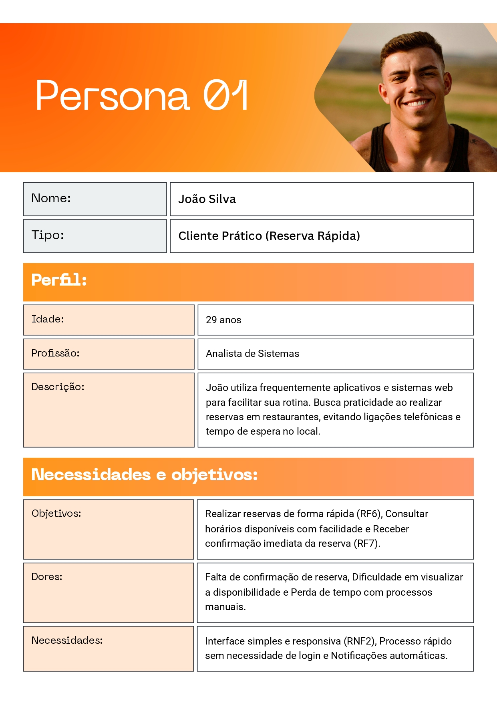
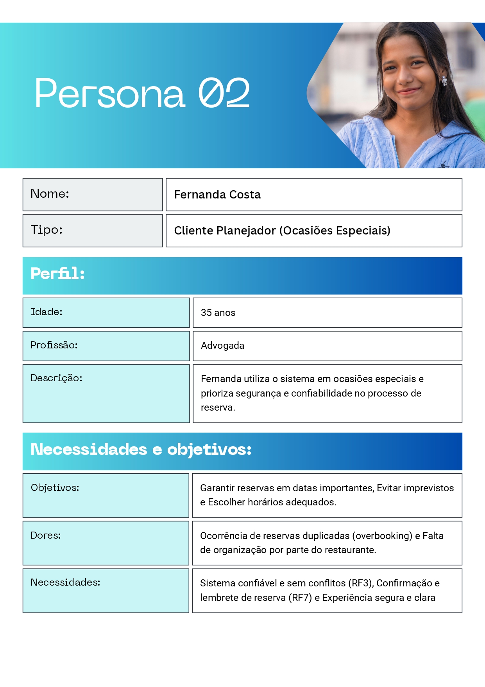
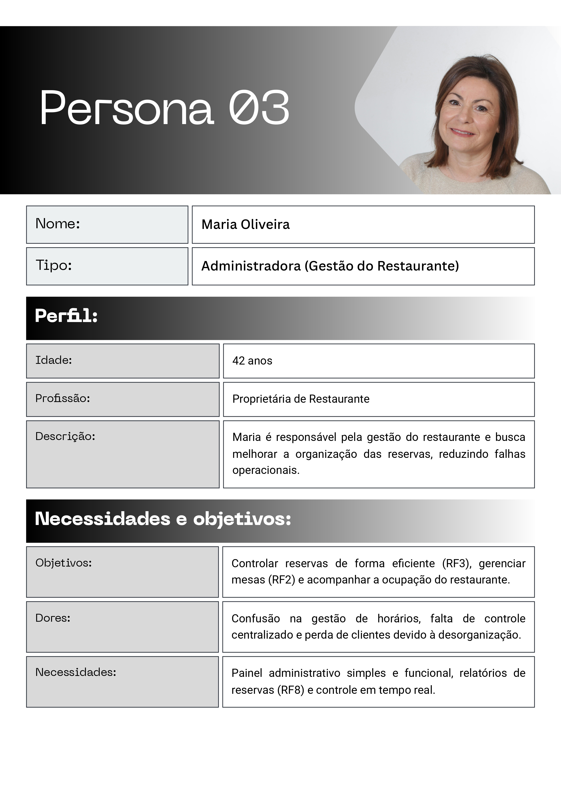
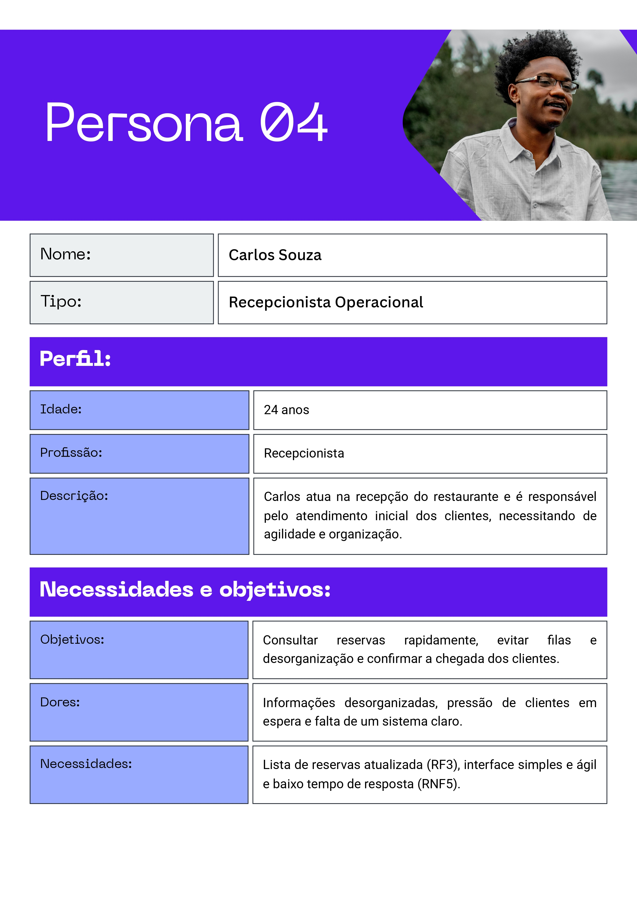
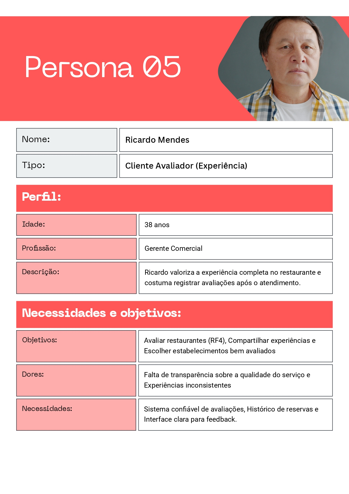
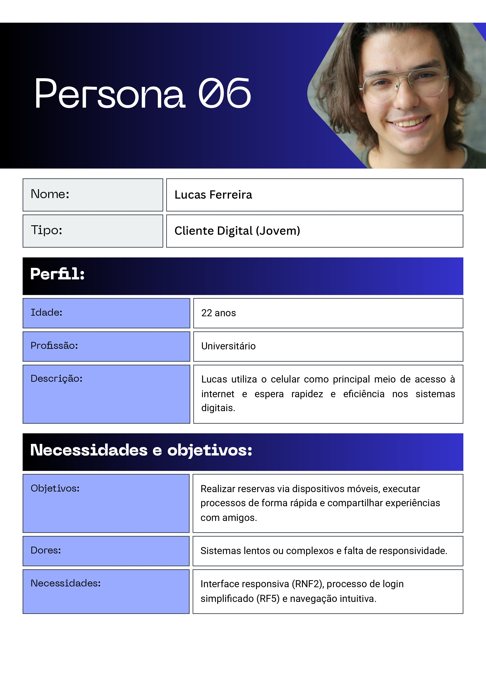

# 4. PROJETO DO DESIGN DE INTERAÇÃO

## 4.1 Personas

### Persona 1 – Cliente Prático (Reserva Rápida)

### Persona 2 – Cliente Planejador (Ocasiões Especiais)

### Persona 3 – Administradora (Gestão do Restaurante)

### Persona 4 – Recepcionista Operacional

### Persona 5 – Cliente Avaliador (Experiência)

### Persona 6 – Cliente Digital Jovem)

## 4.2 Mapa de Empatia

## 4.3 Protótipos das Interfaces
Os protótipos desenvolvidos são de alta fidelidade, apresentando elevado nível de detalhamento visual e funcional, com forte aproximação ao produto final. Foram projetados para ambiente digital (web/mobile), com foco na simulação realista da interação do usuário.
O protótipo possui navegação estruturada e elementos interativos que permitem a realização de fluxos completos, como busca de restaurantes, realização de reservas e gerenciamento de informações pessoais.
O principal objetivo do protótipo é possibilitar a validação da interface por meio de testes com usuários na etapa seguinte do projeto.

### Visão Geral dos Princípios da Gestalt:

Proximidade:
Aplicado nas telas 1, 4, 7 e 13, onde elementos relacionados são posicionados próximos entre si, formando agrupamentos perceptivos claros. Informações de um mesmo restaurante são organizadas em cards (telas 1 e 4), assim como os dados de uma mesma reserva (tela 7). Na tela 13, a agenda semanal segue essa lógica, facilitando a leitura em blocos e a percepção de relação entre elementos.

Figura-fundo:
Utilizado por meio de contraste de cor, tamanho e hierarquia tipográfica, permitindo distinguir elementos interativos do conteúdo informativo. O nome do restaurante se destaca pelo tamanho e peso da fonte, enquanto áreas de ação são visualmente separadas do fundo.

Ponto focal:
A cor vermelha é utilizada como elemento de alto contraste para direcionar a atenção do usuário às ações principais. Botões como “Reservar” e “Buscar restaurantes” (tela 1), bem como “Entrar” (tela 2), funcionam como pontos focais. Esse padrão se repete nas telas 3, 5, 6, 8 e 12.

Similaridade:
Elementos com mesma função apresentam características visuais consistentes. Os cards seguem um padrão estrutural uniforme, e os botões de horários disponíveis possuem formato e cor semelhantes (quinas arredondadas e cor amarela), enquanto os botões de ação principal utilizam vermelho. Isso reforça a categorização funcional e melhora a previsibilidade da interface.

Região comum:
Aplicado por meio da delimitação visual de áreas distintas dentro da interface. Na tela 4, as seções “Minhas Reservas” e “Minhas Avaliações” são separadas por containers, permitindo que cada conjunto de informações seja percebido como independente.

### Visão Geral das Recomendações Ergonômicas:

Usabilidade:
A interface apresenta estrutura simples, com organização clara das informações e uso de linguagem acessível, favorecendo a compreensão e a eficiência de uso.

Carga cognitiva:
A utilização de padrões consistentes, organização visual e fluxo de navegação definido reduz a carga cognitiva, permitindo aprendizado rápido e tomada de decisão mais eficiente.

Legibilidade e acessibilidade:
O uso de contraste adequado, hierarquia tipográfica e dimensionamento apropriado de elementos interativos garante boa legibilidade e reduz a fadiga visual. A interface oferece recursos como ajuste de fonte e modo escuro.

Responsividade:
A interface adapta-se a diferentes dispositivos, mantendo consistência visual e funcional.

## 4.4 Testes com Protótipos
Nesta seção você deve apresentar os testes realizados com usuários utilizando os protótipos de alta fidelidade desenvolvidos na seção anterior. O objetivo é avaliar a usabilidade, a clareza das informações e a adequação do design às necessidades das personas definidas no projeto.

Cada integrante do grupo deverá aplicar o teste com um usuário distinto, preferencialmente alinhado ao perfil das personas criadas. Devem ser definidas previamente as tarefas que o usuário deverá executar no protótipo (por exemplo: realizar um cadastro, buscar um produto, concluir uma compra).

Durante a aplicação do teste, registre observações sobre comportamentos, dúvidas, erros e comentários feitos pelo usuário, bem como o tempo necessário para a execução de cada tarefa. Ao final, colete o feedback do participante, destacando pontos positivos e aspectos a serem melhorados.

Os resultados obtidos por todos os integrantes devem ser consolidados, apresentando uma análise geral com os principais problemas encontrados, oportunidades de melhoria e as ações previstas para o projeto final. 
