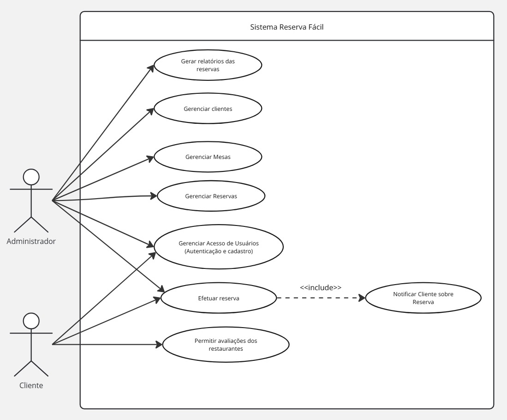
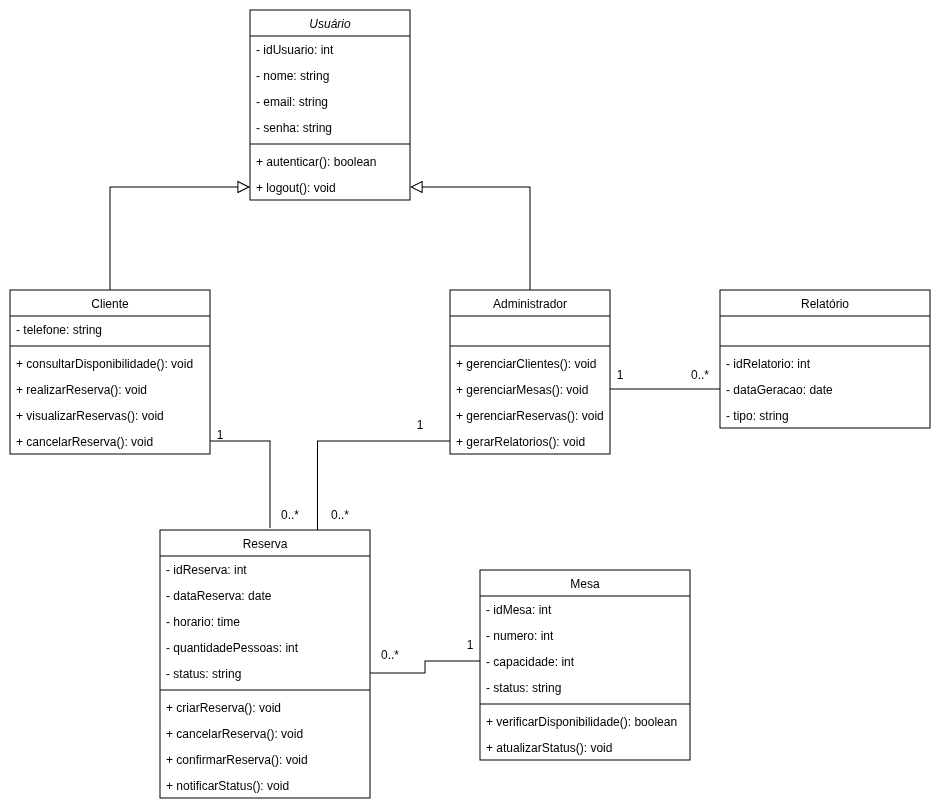

# 3. DOCUMENTO DE ESPECIFICAÇÃO DE REQUISITOS DE SOFTWARE

Segue a documentação dos requisitos do sistema apresentada abaixo:

## 3.1 Objetivos deste documento
Este documento tem como objetivo especificar os requisitos do sistema web de reservas para restaurantes, descrevendo suas funcionalidades, restrições, perfis de usuários e elementos principais de modelagem. A especificação busca orientar o desenvolvimento da solução proposta, servindo como base para as próximas etapas do projeto, especialmente o design de interação, a implementação e os testes.

Além disso, o documento tem a finalidade de registrar de forma clara o escopo do produto, seus limites e os benefícios esperados, garantindo que todos os integrantes da equipe compartilhem a mesma compreensão sobre o sistema a ser desenvolvido, pelos princípios de Design Centrado no Usuário (DCU), visando atender às necessidades de gestores e clientes finais

## 3.2 Escopo do produto

### 3.2.1 Nome do produto e seus componentes principais
O produto será denominado ReservaFácil, um sistema web de reservas para restaurantes de pequeno e médio porte.

O sistema possuirá, inicialmente, os seguintes componentes principais:

•	Módulo de cadastro e autenticação de usuários;

•	Módulo de gerenciamento de mesas;

•	Módulo de gerenciamento de reservas.

### 3.2.2 Missão do produto
A missão do produto é permitir o gerenciamento digital das reservas de restaurantes, promovendo maior organização operacional, redução de conflitos de agendamento e melhoria da experiência do usuário durante o processo de reserva.

### 3.2.3 Limites do produto
O sistema proposto contempla o cadastro e o gerenciamento de reservas e mesas, bem como a consulta de horários disponíveis.

O produto não contempla, nesta versão inicial:

•	Integração com aplicativos externos de mensagens;

•	Controle financeiro do restaurante;

•	Gestão de cardápio e pedidos nas mesas.

### 3.2.4 Benefícios do produto

| # | Benefício | Valor para o Cliente |
|--------------------|------------------------------------|----------------------------------------|
|1	| Facilidade no agendamento de reservas |	Essencial |
|2 | Redução de conflitos de horários | Essencial | 
|3 | Melhor controle da ocupação das mesas | Essencial | 
|4	| Organização das informações de clientes e reservas	| Essencial | 
|5	| Melhoria da experiência do usuário	| Recomendável | 
|6	| Agilidade no atendimento e planejamento operacional	| Recomendável | 

## 3.3 Descrição geral do produto

### 3.3.1 Requisitos Funcionais

O sistema proposto consiste em uma aplicação web destinada ao gerenciamento de reservas de mesas em restaurantes. A solução busca auxiliar na organização do fluxo de clientes, otimizar o uso das mesas disponíveis e reduzir falhas associadas a processos manuais de controle de reservas. O sistema permitirá que clientes realizem reservas de forma digital, enquanto os administradores do restaurante poderão administrar mesas, horários, reservas e dados dos clientes, contribuindo para uma gestão mais eficiente e baseada em informações.

| Código | Requisito Funcional (Funcionalidade) | Descrição                                                                                                                  |
| ------ | ------------------------------------ | -------------------------------------------------------------------------------------------------------------------------- |
| RF1    | Gerenciar Clientes                   | Permitir o cadastro, atualização, exclusão e consulta de dados dos clientes que utilizam o sistema.                        |
| RF2    | Gerenciar Mesas                      | Permitir ao administrador cadastrar, editar, excluir e consultar mesas, incluindo número identificador, capacidade e localização. |
| RF3    | Gerenciar Reservas                   | Permitir ao administrador a criação, alteração, cancelamento e consulta de reservas, associando cliente, data, horário e mesa.              |
| RF4    | Permitir avaliações dos restaurantes   | Permitir que usuários avaliem restaurantes com notas e comentários.                   |
| RF5    | Gerenciar Acesso de Usuários         | Permitir autenticação de usuários (cliente e administrador) por meio de login e senha para acessar o sistema.                                 |
| RF6    | Efetuar Reservas        | Permitir realização de reservas de usuários visitantes (sem login).                                            |
| RF7    | Notificar Cliente sobre Reserva      | Enviar notificações de confirmação e lembretes de reservas ao cliente.                                                     |
| RF8    | Gerar Relatórios de Reservas         | Permitir ao administrador gerar relatórios com informações sobre reservas, cancelamentos e ocupação das mesas.                    |

### 3.3.2 Requisitos Não Funcionais

| Código | Requisito Não Funcional (Restrição) |
|--------------------|------------------------------------|
| RNF1 | O sistema deverá ser desenvolvido como uma aplicação web acessível por meio de navegadores modernos como Google Chrome, Mozilla Firefox e Microsoft Edge. |
| RNF2 | O sistema deverá apresentar interface responsiva, permitindo acesso por computadores, tablets e dispositivos móveis. |
| RNF3 | Segurança: o sistema deverá restringir o acesso às funcionalidades administrativas por meio de autenticação com login e senha individuais. |
| RNF4 | O sistema deverá garantir a proteção das informações dos usuários por meio de armazenamento seguro de dados. |
| RNF5 | O tempo de resposta para operações de consulta de disponibilidade de mesas não deverá ultrapassar 3 segundos em condições normais de uso. |
| RNF6 | O sistema deverá manter registro das reservas realizadas para fins de auditoria e geração de relatórios. |
| RNF7 | O sistema deverá permitir fácil manutenção e atualização do software sem interrupção significativa do serviço. |
| RNF8 | O sistema deverá armazenar as informações inicialmente utilizando armazenamento local (Local Storage) e posteriormente permitir integração com banco de dados relacional, como MySQL. |

### 3.3.3 Usuários 

| Ator | Descrição |
|--------------------|------------------------------------|
| Administrador | Usuário responsável pela administração geral do sistema, incluindo cadastro de mesas, gerenciamento de reservas e geração de relatórios. |
| Cliente | Usuário final que acessa o sistema para consultar disponibilidade de mesas e realizar reservas no restaurante. |

## 3.4 Modelagem do Sistema

### 3.4.1 Diagrama de Casos de Uso

#### Figura 1: Diagrama de Casos de Uso do Sistema.

 
### 3.4.2 Descrições de Casos de Uso

Gerar Relatórios das Reservas (CSU01)

Sumário:
O administrador solicita a geração de relatórios contendo informações sobre as reservas realizadas no sistema.

Ator Primário:
Administrador.

Pré-condições:
O administrador deve estar autenticado no sistema.

Fluxo Principal:

1. O administrador acessa a funcionalidade de relatórios de reservas.
2. O sistema apresenta opções de filtros para geração do relatório (data, período ou cliente).
3. O administrador seleciona os filtros desejados.
4. O sistema processa os dados das reservas.
5. O sistema gera e apresenta o relatório ao administrador.

-----------------------------------------------

Gerenciar Clientes (CSU02)

Sumário:
O administrador realiza a gestão dos dados dos clientes, podendo incluir, alterar, excluir ou consultar informações.

Ator Primário:
Administrador.

Pré-condições:
O administrador deve estar autenticado no sistema.

Fluxo Principal:

1. O administrador acessa a funcionalidade de gerenciamento de clientes.
2. O sistema apresenta as operações disponíveis: inclusão, alteração, exclusão e consulta de clientes.
3. O administrador seleciona a operação desejada.
4. O sistema apresenta os campos necessários para a operação selecionada.
5. O administrador informa ou altera os dados do cliente.
6. O sistema valida os dados informados.
7. O sistema registra a operação realizada.

-----------------------------------------------

Gerenciar Mesas (CSU03)

Sumário:
O administrador realiza a gestão das mesas disponíveis no restaurante, podendo cadastrar, alterar, excluir ou consultar mesas.

Ator Primário:
Administrador.

Pré-condições:
O administrador deve estar autenticado no sistema.

Fluxo Principal:

1. O administrador acessa a opção de gerenciamento de mesas.
2. O sistema apresenta as operações disponíveis: inclusão, alteração, exclusão e consulta de mesas.
3. O administrador seleciona a operação desejada.
4. O sistema apresenta os campos necessários para a operação escolhida.
5. O administrador informa ou altera os dados da mesa.
6. O sistema valida os dados informados.
7. O sistema registra a operação.

-----------------------------------------------

Gerenciar Reservas (CSU04)

Sumário:
O administrador realiza a gestão das reservas cadastradas no sistema.

Ator Primário:
Administrador.

Pré-condições:
O administrador deve estar autenticado no sistema.

Fluxo Principal:

1. O administrador acessa a funcionalidade de gerenciamento de reservas.
2. O sistema apresenta a lista de reservas cadastradas.
3. O administrador pode consultar, incluir, alterar ou cancelar uma reserva.
4. O sistema registra as alterações ou cancelamentos realizados.

-----------------------------------------------

Efetuar Autenticação (CSU05)

Sumário:
O Usuário realiza o login no sistema para acessar as funcionalidades disponíveis.

Ator Primário:
Administrador e Cliente.

Pré-condições:
O Cliente ou Administrador deve possuir cadastro no sistema.

Fluxo Principal:

1. O Cliente ou Administrador acessa a tela de autenticação do sistema.
2. O sistema apresenta os campos de login e senha.
3. O Cliente ou Administrador informa suas credenciais.
4. O sistema valida os dados informados.
5. Se as credenciais forem válidas, o sistema concede acesso.

- Fluxo Alternativo: Credenciais inválidas

 a) O sistema identifica que os dados informados são inválidos.

 b) O sistema informa o erro ao Cliente ou Administrador.

 c) O Cliente ou Administrador pode tentar novamente ou encerrar o caso de uso.

-----------------------------------------------

Efetuar Reserva (CSU06)

Sumário:
O Usuário sem autenticação (Cliente) solicita a realização de reserva no restaurante.

Ator Primário:
Cliente

Ator Secundário:
Administrador

Pré-condições:
O Cliente precisa estar conectado à internet para ter acesso ao sistema. 

Fluxo Principal:

1. O Cliente acessa a funcionalidade de reserva de mesa.
2. O sistema solicita os dados para consultar disponibilidade (data, horário e número de pessoas).
3. O Cliente informa os dados solicitados.
4. O sistema apresenta as opções disponíveis.
5. O Cliente seleciona a opção desejada.
6. O sistema solicita os dados para efetuar a reserva (nome completo, telefone, email e dados de cartão de crédito).
7. O sistema registra e confirma a reserva.
8. O sistema envia confirmação da reserva para o telefone ou email fornecidos pelo Cliente.

- Fluxo Alternativo: Não há disponibilidade

 a) O sistema verifica disponibilidade de acordo com a solicitação.

 b) O sistema informa a indisponibilidade ao Cliente.

 c) O Cliente pode escolher outra data, horário e/ou alterar número de pessoas.

 d) O fluxo retorna ao passo 2 do CSU06.

-----------------------------------------------

Notificar sobre Status da Reserva (CSU07)

Sumário:
O sistema envia uma notificação ao cliente informando o status da reserva realizada.

Ator Primário:
Cliente.

Pré-condições:
Uma reserva deve ter sido registrada no sistema.

Fluxo Principal:

1. Uma reserva é confirmada no sistema.
2. O sistema gera notificação de confirmação.
3. O sistema envia a notificação ao cliente informando o status da reserva.
4. O sistema notifica o Cliente com lembrete sobre proximidade da reserva.

-----------------------------------------------

Avaliar Restaurante (CSU08)

Sumário:
O cliente solicita registrar uma avaliação para um restaurante, atribuindo uma nota e adicionando um comentário sobre sua experiência.

Ator Primário:
Cliente.

Ator Secundário:
Administrador

Pré-condições:
O Cliente deve ter tido reserva em seu nome.

Fluxo Principal:

1. O cliente acessa a página do restaurante desejado.
2. O sistema exibe as informações do restaurante e as avaliações existentes.
3. O cliente seleciona a opção de avaliar o restaurante.
4. O sistema apresenta formulário para inserção da nota e comentário.
5. O cliente preenche o formulário.
6. O cliente confirma o envio da avaliação.
7. O sistema registra a avaliação e exibe a nova avaliação no feed de avaliações.

### 3.4.3 Diagrama de Classes 

A Figura mostra o diagrama de classes do sistema Reserva Fácil. A classe Usuário representa os dados comuns de acesso ao sistema, como identificação, nome, e-mail e senha, sendo especializada nas classes Cliente e Administrador. O Cliente é responsável por consultar a disponibilidade de mesas, realizar, visualizar e cancelar reservas, enquanto o Administrador gerencia clientes, mesas, reservas e relatórios. A classe Reserva armazena as informações relacionadas às reservas realizadas, como data, horário, quantidade de pessoas e status, estando associada a um único cliente e a uma única mesa. A classe Mesa contém os dados das mesas disponíveis no restaurante, como número, capacidade e status. Já a classe Relatório representa os relatórios gerados pelo administrador. Dessa forma, o diagrama de classes apresenta a estrutura estática do sistema, evidenciando os principais atributos, métodos e relacionamentos entre as classes que compõem o domínio da aplicação.

#### Figura 2: Diagrama de Classes do Sistema.
 

### 3.4.4 Descrições das Classes 

| # | Nome          | Descrição                                                                                                                                                                                                        |
| - | ------------- | ---------------------------------------------------------------------------------------------------------------------------------------------------------------------------------------------------------------- |
| 1 | Usuário       | Classe geral que representa os dados de acesso ao sistema, contendo informações como identificação, nome, e-mail e senha. Serve como superclasse para os perfis de cliente e administrador.                      |
| 2 | Cliente       | Classe responsável por representar o usuário que utiliza o sistema para consultar disponibilidade de mesas, realizar, visualizar e cancelar reservas. Herda os dados e comportamentos básicos da classe Usuário. |
| 3 | Administrador | Classe responsável pelo gerenciamento do sistema, permitindo administrar clientes, mesas, reservas e gerar relatórios. Herda os dados e comportamentos básicos da classe Usuário.                                |
| 4 | Reserva       | Classe que armazena as informações relacionadas às reservas realizadas no sistema, como data, horário, quantidade de pessoas e status da reserva. Está associada a um cliente e a uma mesa.                      |
| 5 | Mesa          | Classe que representa as mesas disponíveis no restaurante, armazenando informações como número, capacidade e status de disponibilidade.                                                                          |
| 6 | Relatório     | Classe responsável por representar os relatórios gerados pelo administrador, contendo informações como identificação, data de geração e tipo do relatório.                                                       |
